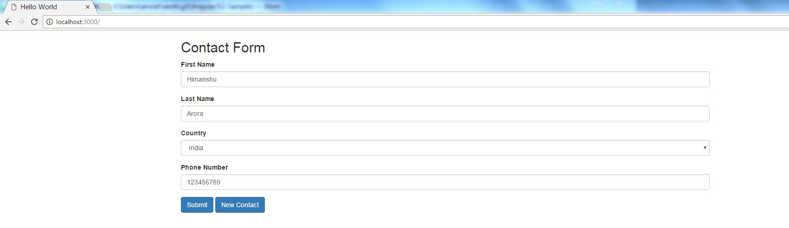

# AngularJS2-Samples
Hands on example of Angular2 

## How to run

    npm install
    npm run  (This will run a lite-server which is a light-weighted node server and app will be available @ localhost:3000)
    

